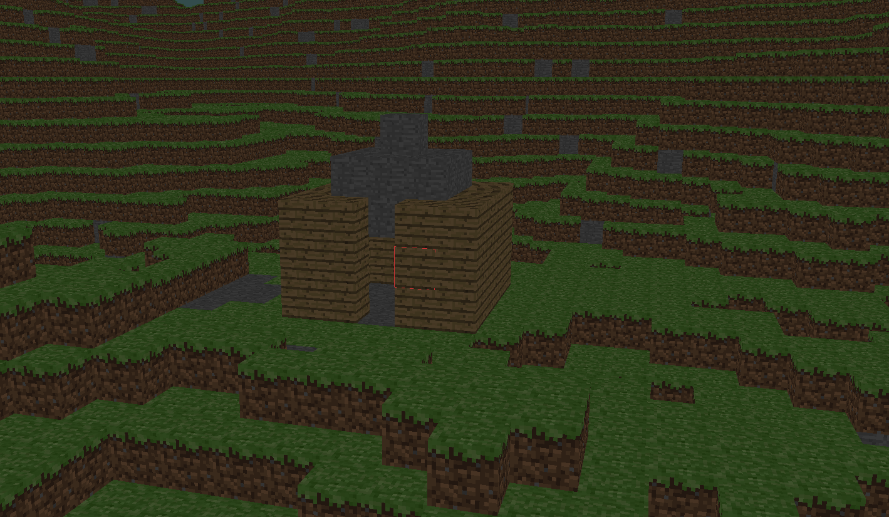
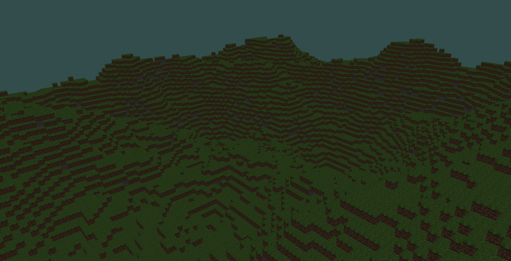
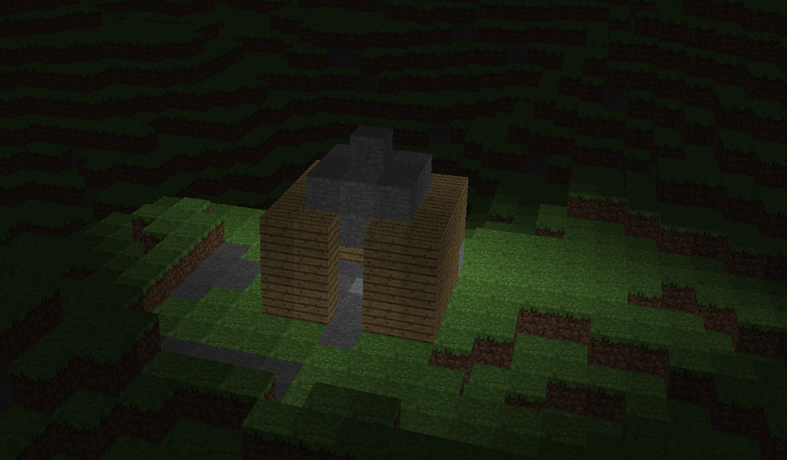
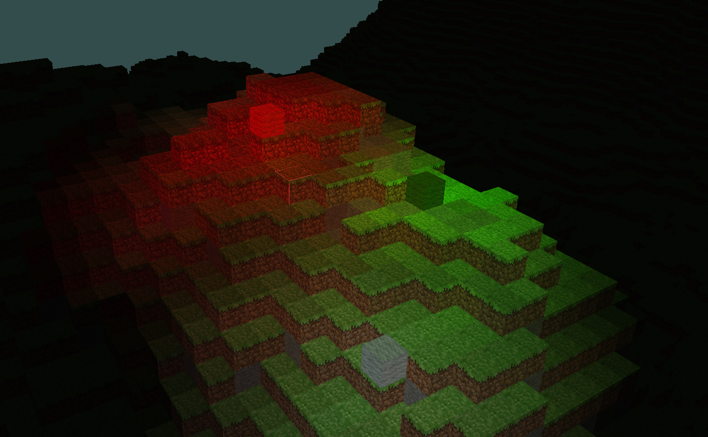
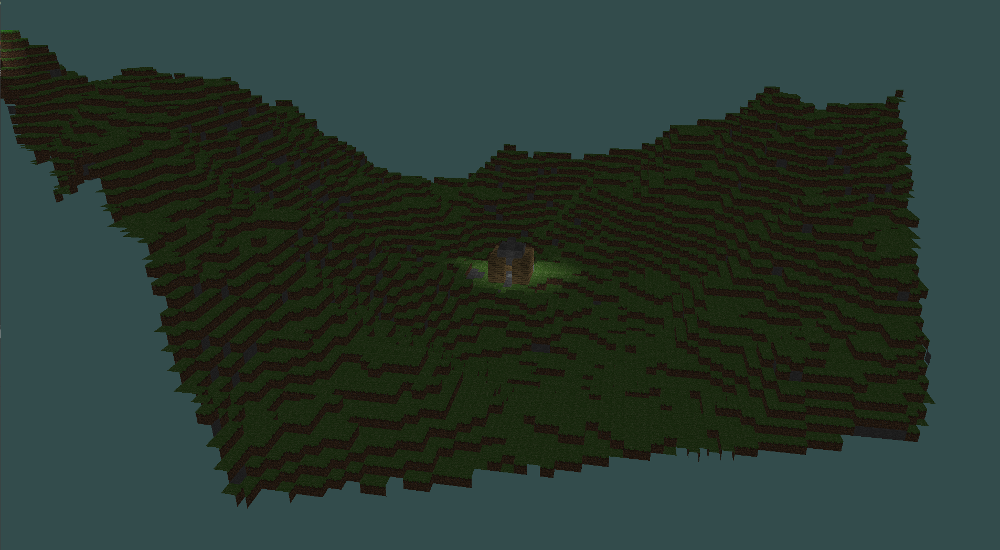

# Minecraft clone in C++ and OpenGL

## Features:

1. Build and destory blocks:

2. Procedural generation with Perlin noise:

3. Dynamic lighting system:

When lights are created, they will spread through the world with a flood fill algorithm.

4. Colored Light blending (currently not completely working):

5. Frustum Culling:

To generate this example, I locked the camera frustum, then moved a little bit.

6. "Sorta" Occlusion Culling:

If a block isn't adjacent to air, then it's impossible to be seen by the player in the normal gameplay. Therefore, we don't have to render it. This is a screenshot of below the world, showing this effect.

7. World file saving/loading:
The game will autmatically save your blocks placed/destroyed in a world file, "save.world", at the project root. If want to create a new world, just delete this file.

## Controls:
-Space: Fly upwards

-LShift: Fly downwards

-WASD: Fly horizontally

-ESC: Exit game

-Left Mouse: Destroy a block (if it's in range)

-Right Mouse: Place a block (if it's in range)

-Q: Change placing block left

-E: Change placing block right

-Up Arrow: Increase Ambient Light Level

-Down Arrow: Decrease Ambient Light Level

-F3: Toggle debug info

-T: Toggle wireframe rendering

-F: Lock camera frustum

-Scroll: Change zoom

## Building:

### Windows:
This is a cmake project, and all the windows dependencies are included with the repository. Therefore, simply make a build directory and perform a cmake configure and generate. If you're using Visual Studio, set your startup project as Minecraft_Clone.

### Linux:
The dependencies must be installed on your system. Therefore, first installed glfw 3.3, and freetype. Then cmake as normal.